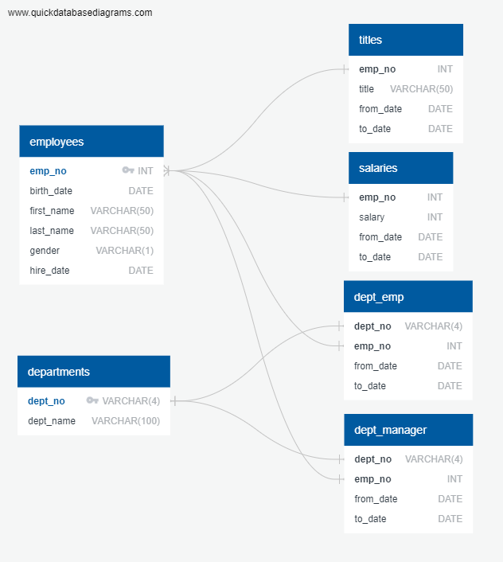

# sql-challenge
The repository contains my solution to HW9-SQL-challenge

## Background
There are essentially 3 main objectives:-
1. Create a database in ```PostgresSQL``` from ```.csv``` files provided in _/data_ folder.
2. Perform queries on the database once generated.
3. Perform preliminary data analysis in ```Python``` by importing the database using ```SQLAlchemy```.
## Prerequisites
You will require two environments to successfully execute the codes in this repository.

* **SQL Environment**: The database was created in ```PostgresSQL-v11.6```. A latest copy can be downloaded from: [EnterpriseDB](https://www.enterprisedb.com/downloads/postgres-postgresql-downloads). You will require a username and password to access ```pgAdmin 4``` which can be replaced in ```config_template.py``` to successfully import the database to ```Python```. Remember to rename ```config_template.py``` to ```config.py``` after adding your username and password.

* **Python Environment**: You should have the following python packages installed in your Python environment to successfully execute run the included jupyter notebooks:-
```
os
sqlalchemy
pandas
numpy
matplotlib.pyplot
math
```
## File Layout
This section explains the step-by-step methodolgy of meeting the objectives as outlined in the **Background** section above.
1. Entity-relationship-diagram (ERD) was first developed by investigating the ```.csv``` files in _/data_ folder. The ERD was generated using https://app.quickdatabasediagrams.com/#/. The raw code to generate the ERD is included in ```ERD_raw.txt```. The resulting diagram is exported as ```ERD.png``` and also included in this repository.

2. In order to generate the tables, ```schema.sql``` is included in _/EmployeesSQL_ folder. The simple export to PostgresSQL from https://app.quickdatabasediagrams.com/#/ is not usually enough to properly generate the database tables, which is then modified to reflect the ```FOREIGN KEY``` and ```PRIMARY KEY``` in the tables. To generate the schema, ```schema_helper.ipynb``` is also used which somewhat reduces the typing involved in creating the schema. 

3. After creation of the tables using ```schema.sql``` the next step is to populate the tables using the ```.csv``` files. In order to achieve that, copy _/data_ folder to your local drive and modify the path to ```.csv``` files in ```populate_tables_from_csv.sql``` in __EmployeeSQL__ folder. You can use ```schema_helper.ipynb``` to modify the path and use it to automatically generate the output which can then be copied to ```populate_tables_from_csv.sql``` and executed. This will create the entire database, which can then be queried. __OBJECTIVE 1 ACCOMPLISHED__

4. After creation of the database by following steps 1 - 3 above, ```query.sql``` can be used to query the data and answer the questions outlined as comments in ```query.sql```. __OBJECTIVE 2 ACCOMPLISHED__.

5. The database is imported in ```Python``` using ```sqlalchemy``` and preliminary analysis on salaries is performed in ```employees_db_analysis.ipynb```. Essentially two main questions are answered:

      a. What is the most common salary range for the employees?
  
      b. What are the average salaries by title?
    
    The analysis completes the goals outlined in the section above. __OBJECTIVE 3 ACCOMPLISHED__.
